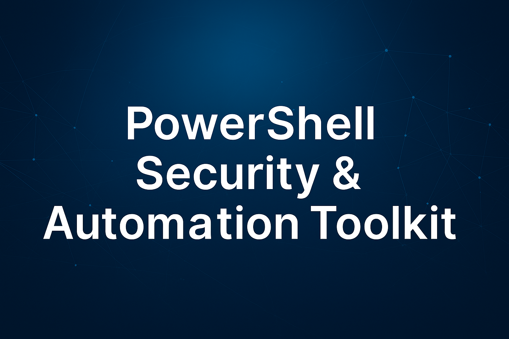

  

<h1 align="center">PowerShell Security & Automation Toolkit</h1>
<h3 align="center">By Scott Malin — Cybersecurity & Automation Architect</h3>

Production‑ready PowerShell tools for AD security, endpoint diagnostics, and repo governance.

  
  
  
  

---

# ⭐ Featured Script

### AD-PrivilegeAnalyzer.ps1  
**Goal:** Identify privilege drift and shadow admin exposure in Active Directory.

---

# 📁 Repository Structure

(Include your script catalog with goal statements.)

---

# 🕒 Version History / Changelog

### v1.3 — January 2026  
- Added Cyber Blue banner  
- Unified README structure  
- Featured script section added  
- Cross‑repo links standardized

---

# 🔗 Cross‑Links

- Cybersecurity Prompts → https://github.com/scottmalin68-commits/Cybersecurity-Prompts  
- Misc Prompts → https://github.com/scottmalin68-commits/Misc-AI-Prompts  
- Learning Games → https://github.com/scottmalin68-commits/Learning-Games-Prompts  
- Profile → https://github.com/scottmalin68-commits

---

# 📜 License  
MIT License — see `LICENSE` for details.
