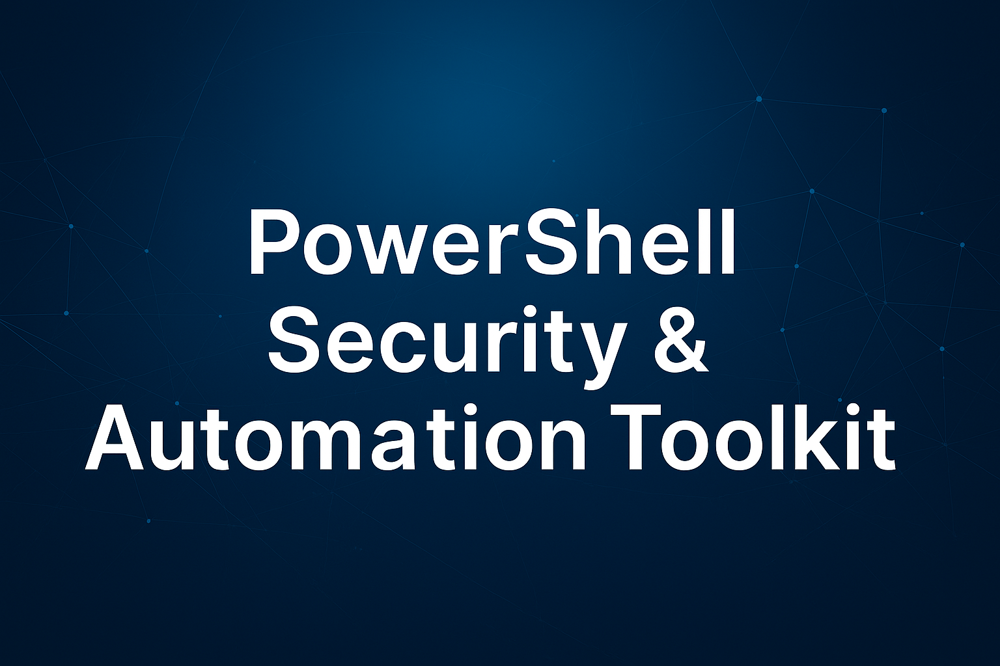

  

<h1 align="center">PowerShell Security & Automation Toolkit</h1>
<h3 align="center">By Scott Malin — Cybersecurity & Automation Architect</h3>

Production-ready PowerShell tools for Active Directory hardening, privilege hygiene, endpoint forensics, and repo governance.

  
  
  
  
  

---

# ⭐ Featured Script

### AD-PrivilegeAnalyzer.ps1  
**Goal:** Identify privilege drift, shadow admins, and over-privileged accounts in Active Directory.

---

# 📁 Repository Structure

A focused collection of operational PowerShell scripts and one module. Each includes inline comments and (where applicable) example usage.

- **AD-PrivilegeAnalyzer.ps1** — Detects privilege escalation risks and shadow admin exposure  
- **AD-Security-Posture-Scanner.ps1** — Comprehensive AD security posture assessment  
- **Invoke-ADAttackPathShortener.ps1** — Identifies and helps shorten common AD attack paths  
- **Invoke-ADLeastPrivilegeAdvisor.ps1** — Recommends least-privilege adjustments for accounts/groups  
- **Stale-Access-Auto-Reaper.ps1** — Automatically identifies and removes stale permissions/access  
- **SuspiciousProcessHunter.ps1** — Hunts for anomalous/suspicious running processes on endpoints  
- **SystemHealthCheck.ps1** — Broad system diagnostics (services, disk, memory, etc.)  
- **Why-Is-This-Machine-Slow.ps1** — Root-cause analysis for performance issues  
- **Why-WasAccountLocked.ps1** — Investigates recent account lockout events  
- **RepoHealthChecker.psm1** — Module for Git repo hygiene, license checks, and governance  

Additional folders:
- `examples/` — Sample output / usage demos  
- `.github/workflows/` — CI automation (if any active)

---

# 🕒 Version History / Changelog

### v1.3 — January 2026  
- Added Cyber Blue banner  
- Unified README structure  
- Featured script section added  
- Cross-repo links standardized

### v1.4 — February 2026  
- Filled in full script catalog with goal statements  
- Improved repo description for discoverability  
- Added dynamic stars badge  

---

# 🔗 Cross-Links

- Cybersecurity Prompts → https://github.com/scottmalin68-commits/Cybersecurity-Prompts  
- Misc Prompts → https://github.com/scottmalin68-commits/Misc-AI-Prompts  
- Learning Games → https://github.com/scottmalin68-commits/Learning-Games-Prompts  
- Profile → https://github.com/scottmalin68-commits  

---

# 📜 License  
MIT License — see `LICENSE` for details.