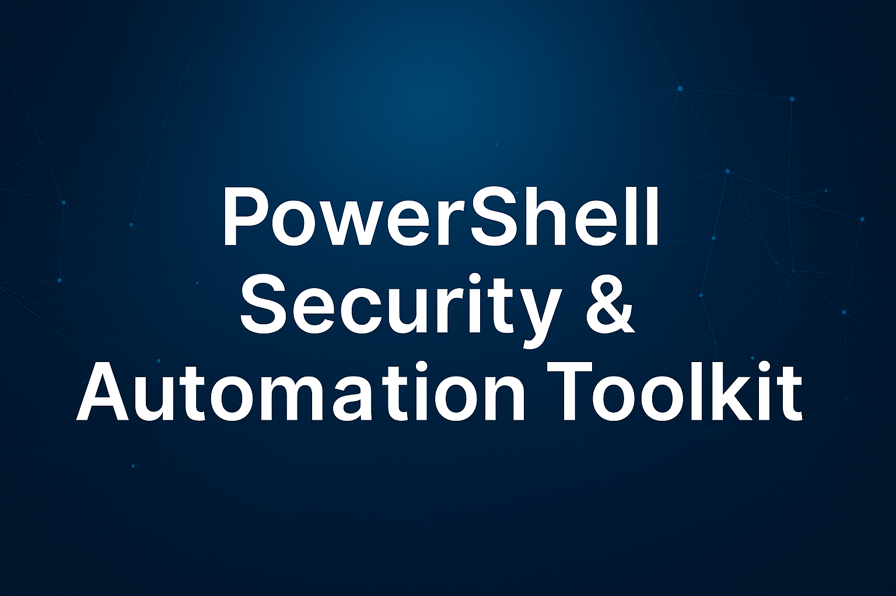

  

<h1 align="center">PowerShell Security & Automation Toolkit</h1>
<h3 align="center">By Scott Malin — Cybersecurity & Automation Architect</h3>

Production-ready PowerShell tools for Active Directory hardening, privilege hygiene, endpoint forensics, code signing, system inventory, and practical operational automation.

  
  
  
  
  
  

---

# ⭐ Featured Scripts

### **AD-PrivilegeAnalyzer.ps1** — v1.0.0
**Goal:** Capture privileged-group baselines, detect membership drift, and flag shadow-admin ACL rights with scored CSV/HTML reports.

### **SuspiciousProcessHunter.ps1** — v1.3.0
**Goal:** Hunt anomalous processes and outbound connections with CIM parent resolution, path/hash rules, optional VirusTotal, HTML/CSV reports, and ShouldProcess quarantine.

### **AD-Security-Posture-Scanner.ps1** — v1.2.0
**Goal:** Scale-safe AD hygiene and privilege scan — stale accounts, delegation/UAC flags, AS-REP roast risk, privileged-group nesting — exported to scored CSV.

---

# 📘 Overview

This repository is a focused operational toolkit. Scripts are written for **PowerShell 5.1+**, prefer **CIM over deprecated WMI**, fail closed on missing data, and avoid PS7-only syntax.

Use them for:
- Active Directory privilege reviews and attack-path reduction
- Endpoint hunting, health, inventory, and lockout forensics
- Code-signing hygiene
- Day-to-day admin utilities

AD scripts require the Active Directory RSAT module and an account that can read the objects being analyzed. Remediation scripts support `-WhatIf` / `ShouldProcess` where they change state.

---

# 📁 Repository Catalog

Exact filenames below. Versions reflect the 2026-08-25 and 2026-09-03 hardening passes.

## Active Directory & Privilege Hygiene

- **[AD-PrivilegeAnalyzer.ps1](AD-PrivilegeAnalyzer.ps1)** — v1.0.0  
  *Goal:* Capture vs Analyze modes for privileged membership drift and shadow-admin ACL detection. Nested-group checks, SID resolution, scored HTML report.

- **[AD-Security-Posture-Scanner.ps1](AD-Security-Posture-Scanner.ps1)** — v1.2.0  
  *Goal:* Domain-wide hygiene and posture scan with targeted AD properties, local group-DN maps, and `Members` collections (avoids the 5,000-member ADWS cap).

- **[Invoke-ADAttackPathShortener.ps1](Invoke-ADAttackPathShortener.ps1)** — v1.1.0  
  *Goal:* Build a group + ACL privilege graph, BFS shortest path to Domain Admins, rank the most dangerous users. Optional CSV/JSON export.

- **[Invoke-ADLeastPrivilegeAdvisor.ps1](Invoke-ADLeastPrivilegeAdvisor.ps1)** — v1.1.0  
  *Goal:* Recommend unused groups, stale memberships, and unrestricted service-account logon rights. Null LastLogon handled without false positives.

- **[Stale-Access-Auto-Reaper.ps1](Stale-Access-Auto-Reaper.ps1)** — v1.2.0  
  *Goal:* Disable stale *local* admins only. Skips RID-500, never mutates domain identities, pauses on high-risk roles, logs a SIEM-ready payload. `-WhatIf` supported.

## Endpoint Forensics & Diagnostics

- **[SuspiciousProcessHunter.ps1](SuspiciousProcessHunter.ps1)** — v1.3.0  
  *Goal:* Process + TCP hunt with unusual-parent, temp-path, and baseline-hash rules. VT lookups only on flagged hashes. CSV + styled HTML. Optional quarantine.

- **[SystemHealthCheck.ps1](SystemHealthCheck.ps1)** — v1.1.0  
  *Goal:* Local or remote CPU/memory/disk/process/registry/Defender-hash check. CIM metrics, SHA256 endpoint hash, SMTP via `SmtpClient`, optional report diff.

- **[Why-Is-This-Machine-Slow.ps1](Why-Is-This-Machine-Slow.ps1)** — v1.3.0  
  *Goal:* Snapshot root-cause for slowness — CIM perf counters, disk queue, paging, Defender scan state, recent security events, confidence score.

- **[Why-WasAccountLocked.ps1](Why-WasAccountLocked.ps1)** — v1.1.0  
  *Goal:* Multi-DC 4740/4625 analysis with XML EventData parsing. Explains when, which DC, and which workstation caused the lockout.

- **[SystemInventory.ps1](SystemInventory.ps1)** — v1.7.0  
  *Goal:* Capture apps, modules, env vars, OEM key, shortcuts, and Winget manifest into a UTF-8 JSON rebuild profile. Companion: System Rebuild Architect Engine in Misc-AI-Prompts.

## Code Signing & Script Integrity

- **[Code Signature Auditor.ps1](Code%20Signature%20Auditor.ps1)**  
  *Goal:* Scan the working directory for signable files and bucket Authenticode results: unsigned / valid / invalid.

- **[SelfSigningScript.ps1](SelfSigningScript.ps1)**  
  *Goal:* Create a local code-signing cert if needed and sign scripts with timestamping.

## Operational Utilities

- **[Meeting cost.ps1](Meeting%20cost.ps1)** — v1.3.0  
  *Goal:* Live meeting-cost dashboard with add/remove participants, tangent logging, and a closing summary.

- **[PromptLoad.ps1](PromptLoad.ps1)**  
  *Goal:* Helper for loading prompt content into a session.

- **[wifi-backup.ps1](wifi-backup.ps1)**  
  *Goal:* Back up saved Wi-Fi profiles.

- **[wifi-qr-display.ps1](wifi-qr-display.ps1)**  
  *Goal:* Display Wi-Fi credentials as a QR code.

- **[RepoHealthChecker.psm1](RepoHealthChecker.psm1)**  
  *Goal:* Module for Git repo hygiene, license checks, and governance. Used by CI.

## Supporting

- `examples/` — sample usage
- `.github/workflows/repo-health.yml` — CI repo-health check
- `LICENSE` / `README.md` / banner image

---

# 🛠 Hardening Notes (Current Pass)

Shared patterns across the updated scripts:

| Theme | What changed |
|---|---|
| CIM, not WMI | `Get-CimInstance` for OS, CPU, memory, disk, process parent maps |
| PowerShell 5.1 | No ternary (`?:`) operators; `CmdletBinding` / `ShouldProcess` where state changes |
| Scale | Targeted `-Properties`, `List`/`HashSet` collections, adjacency maps, `Members` instead of `Get-ADGroupMember` |
| Null safety | LastLogon / LastLogonDate guarded before date compares; RID-500 skipped |
| Output | UTF-8 JSON/CSV/HTML; fail-soft on permission and remoting errors |

---

# 📅 Version History / Changelog

### **v1.6 — 2026-09-03**
- **SystemInventory** → v1.7.0 — CIM licensing/OS, UTF-8 JSON, safer OEM key and shortcut collection, Winget export
- **SystemHealthCheck** → v1.1.0 — CIM metrics, remote `ArgumentList`, SHA256 Defender hash, `SmtpClient` alerts, report diffs
- **SuspiciousProcessHunter** → v1.3.0 — CIM process map, baseline hash compare, VT-on-flagged-only, ShouldProcess quarantine
- **Stale-Access-Auto-Reaper** → v1.2.0 — null LastLogon guard, RID-500 skip, PS 5.1 conditionals, ShouldProcess
- **AD-Security-Posture-Scanner** → v1.2.0 — targeted properties, GroupDNMap, Members-based group size, UAC flag checks
- **Invoke-ADAttackPathShortener** → v1.1.0 — identity map, scoped ACLs, adjacency HashTable, List/HashSet BFS

### **v1.5.1 — 2026-08-25**
- **AD-PrivilegeAnalyzer** → v1.0.0 — ACL bitwise fix, nested groups, SID resolution, HTML report
- **Invoke-ADLeastPrivilegeAdvisor** → v1.1.0 — null member/LastLogon handling, CSV/JSON export messages
- **Why-Is-This-Machine-Slow** → v1.3.0 — elevation check, CIM perf data, CPU/core and I/O metric fixes
- **Why-WasAccountLocked** → v1.1.0 — multi-DC discovery, XML EventData parsing, case-insensitive match

### **v1.5 — August 2026**
- Added/expanded utilities: Meeting cost tracker (v1.3.0), Code Signature Auditor, SelfSigningScript, SystemInventory (JSON edition)
- Recategorized catalog (AD / Endpoint / Signing / Utilities)

### **v1.4 — February 2026**
- Full script catalog with goal statements
- Dynamic stars badge

### **v1.3 — January 2026**
- Cyber Blue banner, unified README, featured scripts, cross-repo links

---

# 🔗 Cross-Links

- 🛡 **Cybersecurity Prompts** → https://github.com/scottmalin68-commits/Cybersecurity-Prompts
- ☁️ **Azure-Related Prompts** → https://github.com/scottmalin68-commits/Azure-Related-Prompts
- 💼 **Job Search & Career Prompts** → https://github.com/scottmalin68-commits/Job-Search-Career-Prompts
- 🧩 **Misc AI Prompts** → https://github.com/scottmalin68-commits/Misc-AI-Prompts
- 🎮 **Cybersecurity Learning Prompts** → https://github.com/scottmalin68-commits/Cybersecurity-Learning-Prompts
- 🧭 **Profile** → https://github.com/scottmalin68-commits

---

# 📜 License
MIT License — see `LICENSE` for details.
